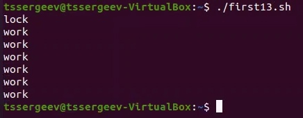
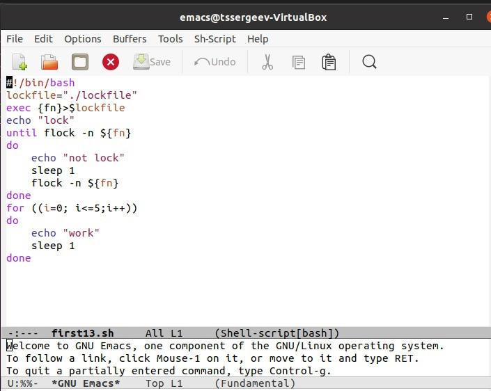
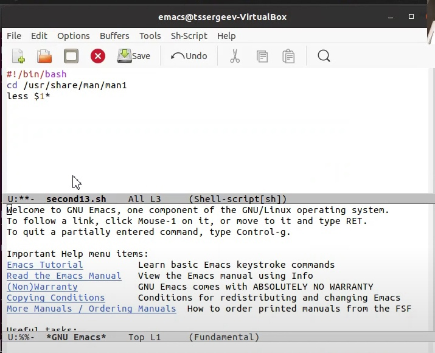
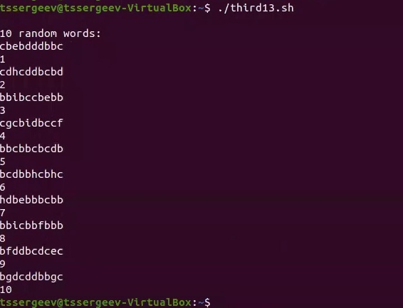
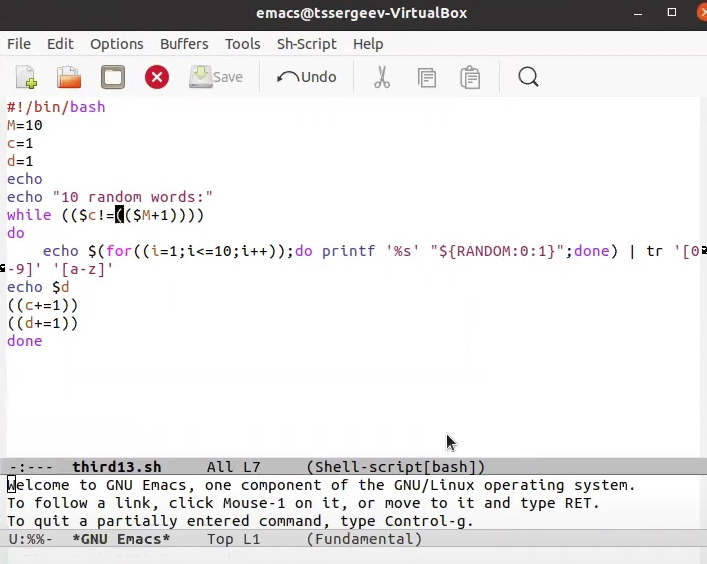

# Отчёт по лабораторной работе №13
## Программирование в командномпроцессоре ОС UNIX. Расширенное программирование

---

## Цель выполнения лабораторной работы

Изучить основы программирования в оболочке ОС UNIX. Научиться писать более сложные командные файлы с использованием логических управляющих конструкций и циклов.

---

## Задачи выполнения лабораторной работы

1. Ознакомиться с теоретическим материалом.

2. Выполнить упражнения.

3. Ответить на контрольные вопросы.

---

## Задание 1. 

-Создаем файл, с которым будем работать

-Открываем его для редактирование через emacs

-Пишем командный файл, следуя условию задания

-Меняем разрешения доступа к файлу

-Запускаем командный файл

---

---

## Задание 2. 

-Создаем файл, с которым будем работать, и открываем его для редактирование через emacs

-Пишем командный файл, следуя условию задания

-Меняем разрешения доступа к файлу и запускаем его 

---

---

## Задание 3. 

-Создаем файл, с которым будем работать, и открываем его для редактирование через emacs

-Пишем командный файл, следуя условию задания

-Меняем разрешения доступа к файлу и запускаем его

---

---

## Вывод

В ходе выполнения поставленных задач я продолжил знакомство с основами программирования в оболочке ОС UNIX/Linux., а именно научился писать более сложные командные файлы с использованием логических управляющих конструкций и циклов.

---

# ***Спасибо за внимание!***
## ʕ ᵔᴥᵔ ʔ

